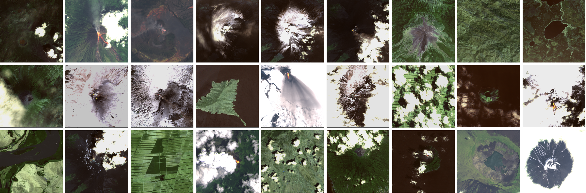

# On Board Volcanic Eruption Detection

Repository for "On Board Volcanic Eruption Detection through CNNs and Satellite Multispectral Imagery"

If you want to use our dataset plase cite our work:

    @article{del2021board,
      title={On-board volcanic eruption detection through cnns and satellite multispectral imagery},
      author={Del Rosso, Maria Pia and Sebastianelli, Alessandro and Spiller, Dario and Mathieu, Pierre Philippe and Ullo, Silvia Liberata},
      journal={Remote Sensing},
      volume={13},
      number={17},
      pages={3479},
      year={2021},
      publisher={Multidisciplinary Digital Publishing Institute}
    }
